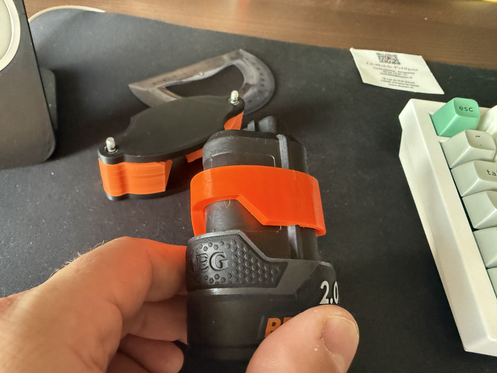
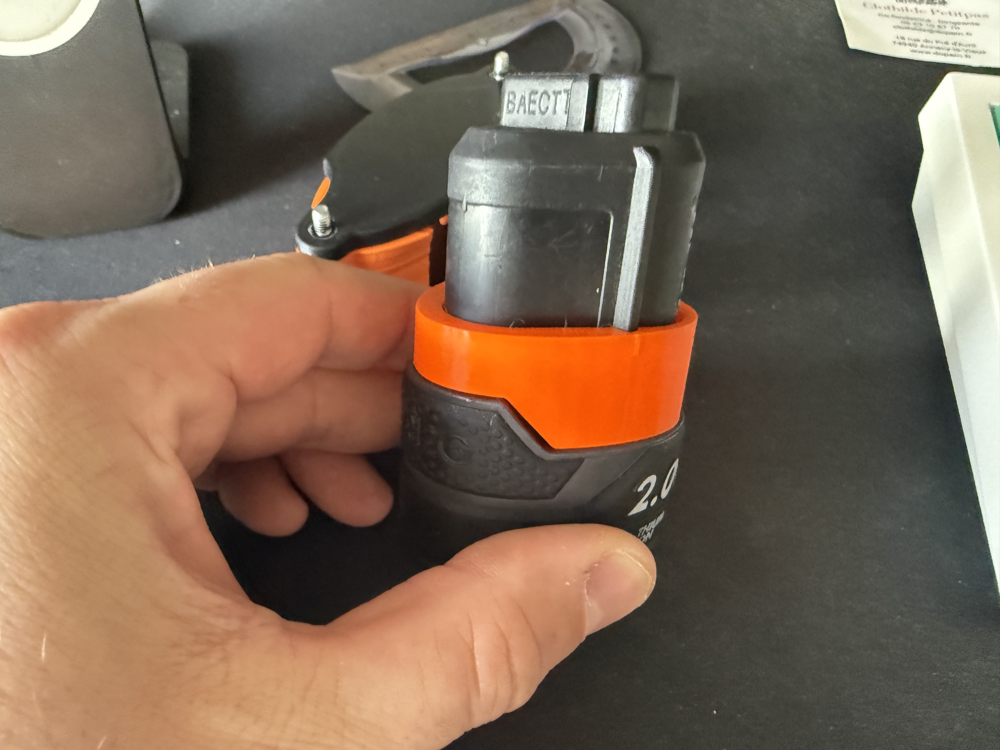
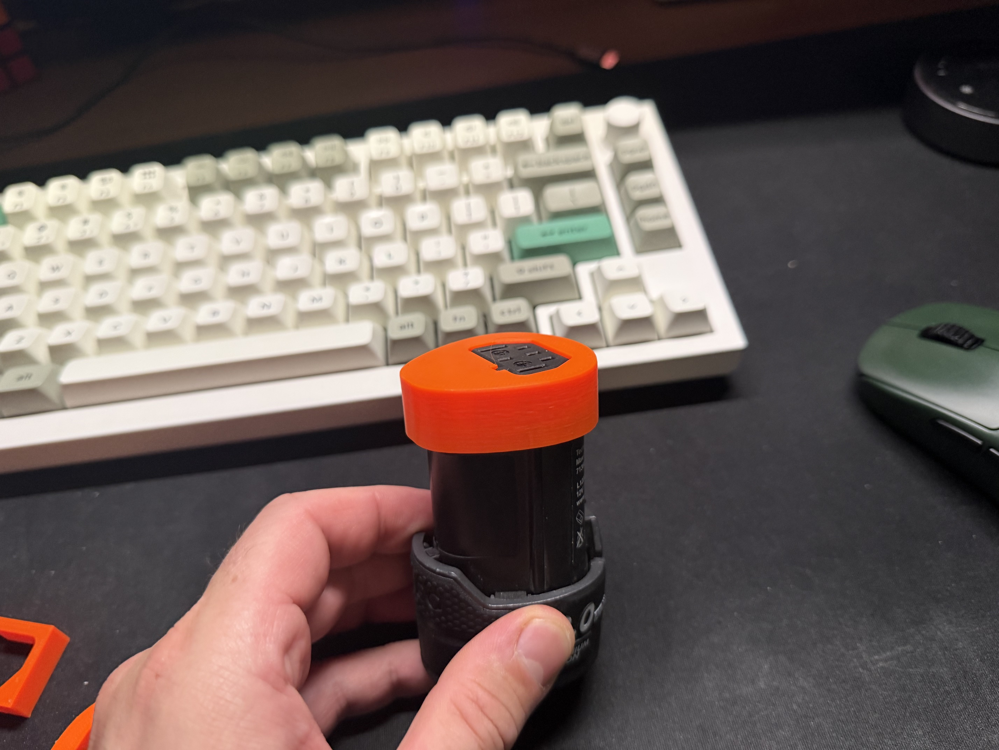
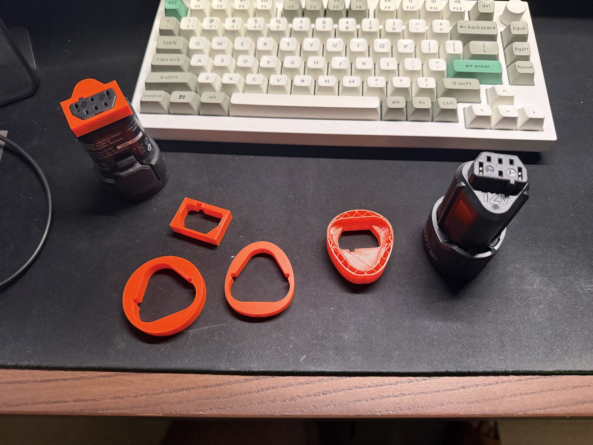
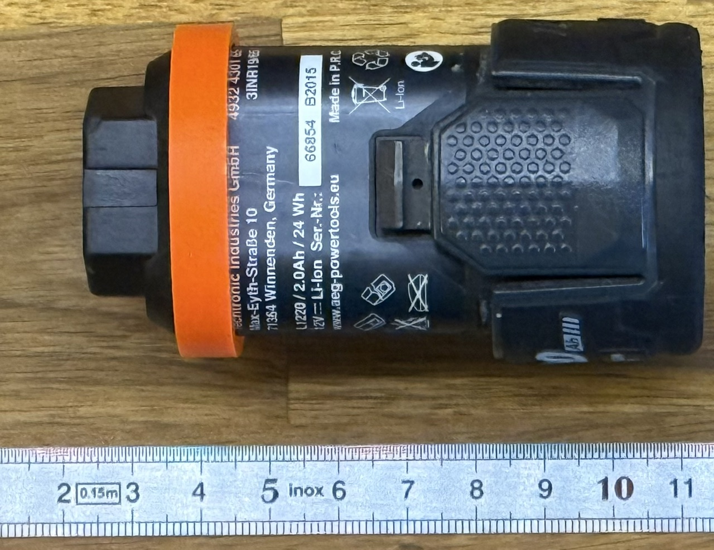
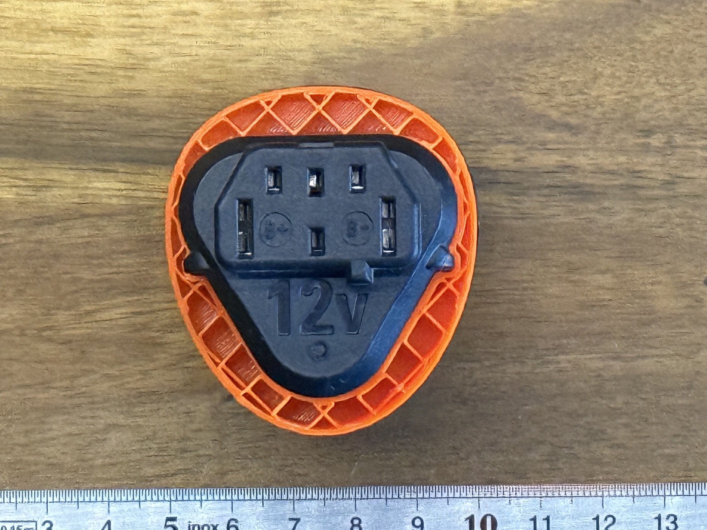
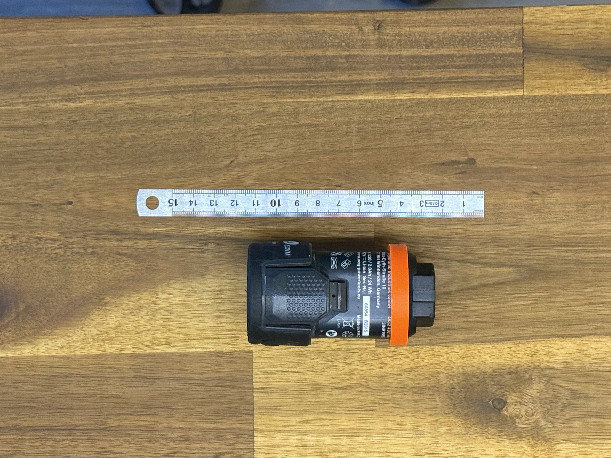
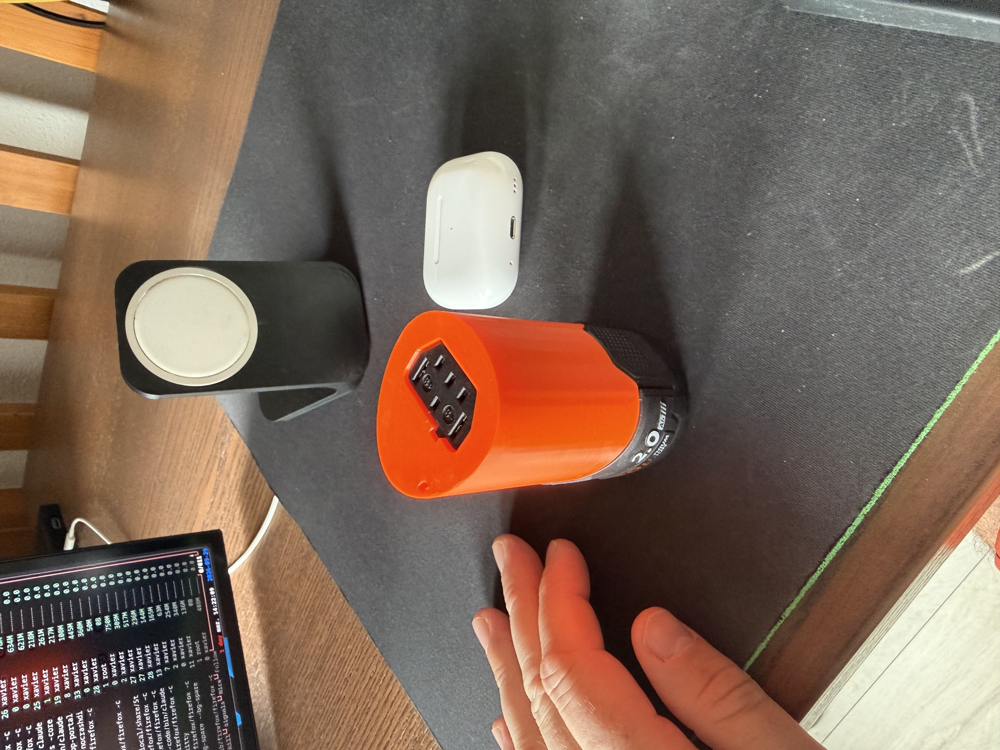

# FreeCAD AEG Battery Support

Personal project to design a 3D-printable battery support/mount in FreeCAD
for an AEG (power tools) battery pack that I own — the kind used in AEG
cordless drills — modeled from my own reference photos.

This isn't a tutorial — it's my own modeling attempt, following the approach
shown in a YouTube tutorial but applied to my own battery. I'll add more
YouTube references here as the project progresses.

## Reference tutorial(s)

- Barbatronic —
  ["\[TUTO\] - FreeCAD - Créer une pièce 3D à partir d'une photo"](https://youtu.be/XsQBDVEu6WY) —
  shows how to bring a photo into FreeCAD as a reference/background image on
  a sketch plane and trace a real object's outline from it to build an
  accurate 3D model.

## Project structure

```
pics/                   # reference photos of the battery (raw shots and
                         # cropped/aligned "layout" versions used for tracing)

docs/
└── screenshots/
    ├── gimp/            # screenshots documenting image cleanup in GIMP
    ├── freecad/         # screenshots documenting the FreeCAD modeling steps
    └── prints/          # photos documenting the 3D print test iterations
                          # and the final print

cad/                     # FreeCAD source file(s) (.FCStd)

exports/                 # STEP / STL / 3MF exports for slicing and printing
```

## Print tests

A few iterations were needed to get the connector opening and the overall
fit right:

| | | |
|---|---|---|
|  |  |  |
|  |  |  |
|  | | |

## Final print



## Status

v1.0.0 — first working print, fitted and validated on the actual battery.
